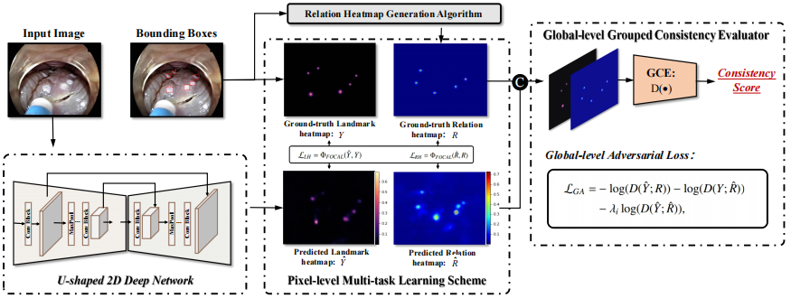

# Real-time landmark detection for precise endoscopic submucosal dissection via shape-aware relation network

We propose a novel shape-aware relation network for accurate and real-time landmark detection in endoscopic submucosal dissection (ESD) surgery. 
This task is of great clinical significance but extremely challenging due to bleeding, lighting reflection, and motion blur in the complicated surgical environment.

This paper has been accepted by [MEDIMA 2021]().
Get the full paper on [Arxiv]().

Fig. 1. Overview of our proposed shape-aware relation network for real-time landmark detection in ESD surgery.

## Code List

- [x] Network
- [x] Pre-processing
- [x] Training Codes
- [ ] Pretrained Weights

For more details or any questions, please feel easy to contact us by email ^\_^

## Usage
1. Install the library of COCO and DCNv2.
## Weight

## TODO

## Citation
